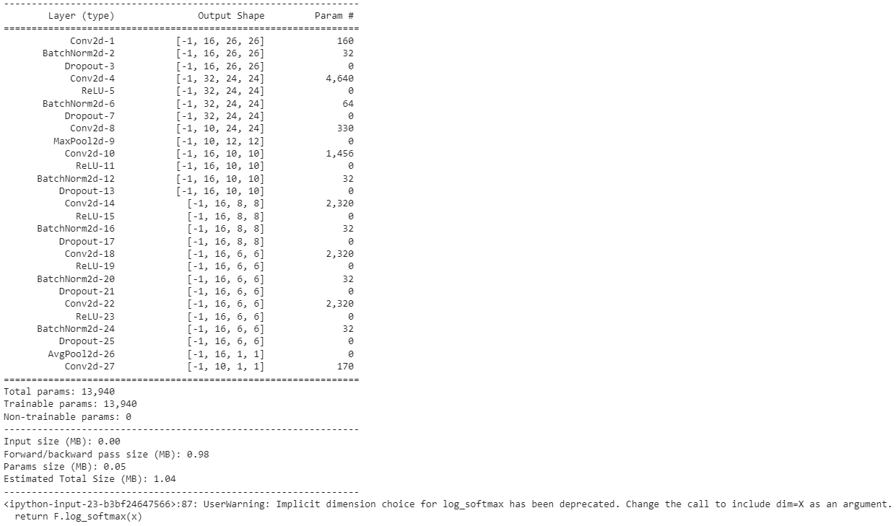
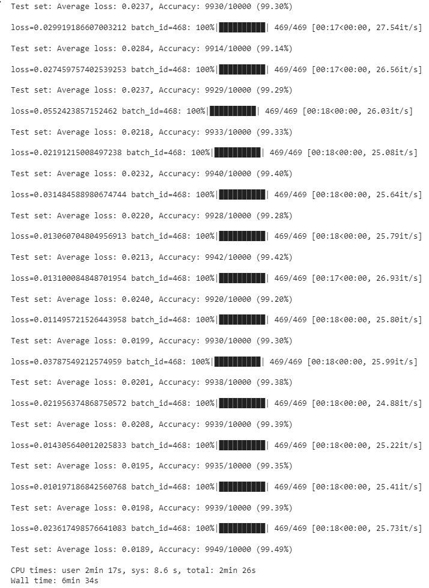

# Train NN to acieve
1. 99.4% validation accuracy
2. Less than 20k Parameters
3. Less than 20 Epochs
4. Have used BN, Dropout, a Fully connected layer, have used GAP. 

The data is from the MNIST dataset, handwritten digit database.
  

To achieve above task, here is the architecture and number of parameters.
 

The log of training.
 
