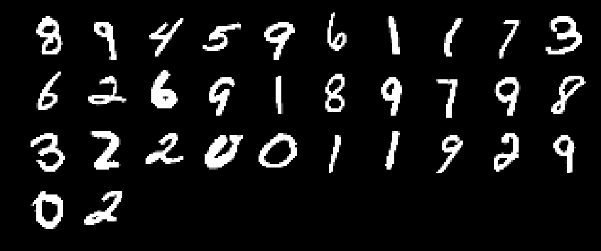
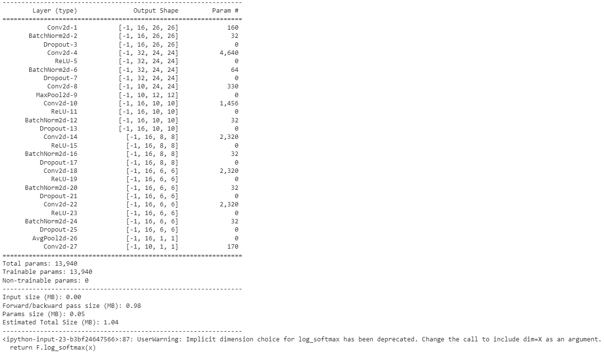
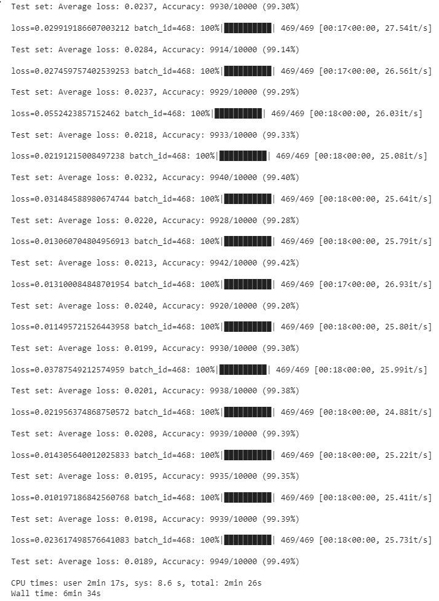

# Train NN to achieve
1. 99.4% validation accuracy.  
2. Less than 20k Parameters.  
3. Less than 20 Epochs.  
4. Have used BN, Dropout, a Fully connected layer, have used GAP.   

# The data is from the MNIST dataset, handwritten digit database.  
   

# Goal Achieved! Architecture and number of Parameters:  
  

# The log of training.  
  
